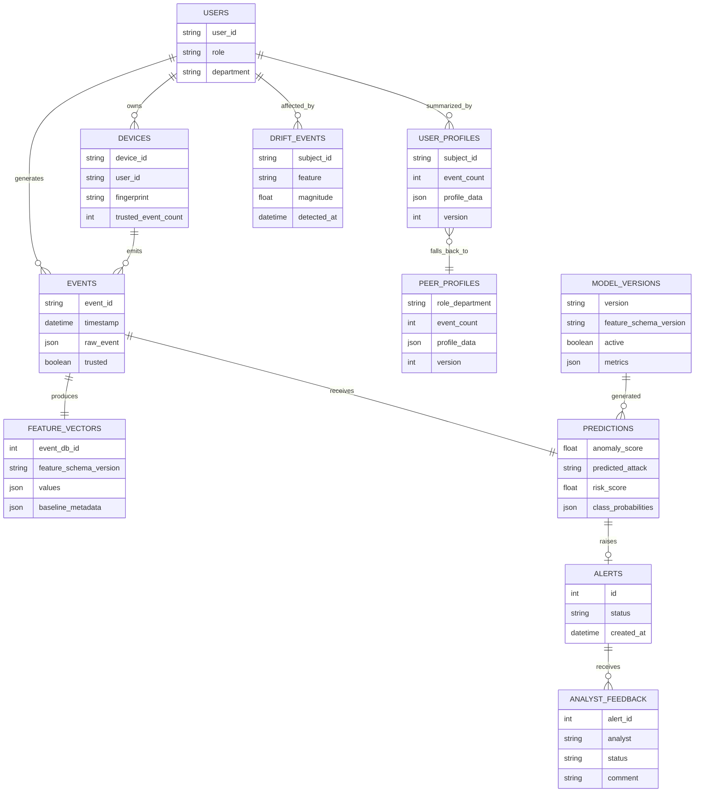

# Deviance architecture

## Problem definition

Deviance detects credential misuse, brute force, lateral movement, impossible travel, and device spoofing by learning how identities and devices normally access systems. It does not consult malicious-IP lists, hashes, CVEs, payload signatures, or domain blocklists. Behavioral rules exist only inside feature generation, safety checks, explanations, and cold-start fallbacks; the Isolation Forest and Random Forest make the primary detection and classification decisions.

## End-to-end event flow

1. The reproducible generator creates 120 users, their devices, offices, roles, resources, mostly normal traffic, and labelled multi-event attacks.
2. Chronological train, validation, test, and demo-stream JSONL files are produced.
3. Training walks events in timestamp order. Only earlier trusted-normal observations may affect the current feature vector.
4. A `RobustScaler`, Isolation Forest, weighted Random Forest, feature order, schema version, thresholds, and metrics are saved as one guarded bundle.
5. The HTTP API validates raw telemetry with Pydantic, selects a user/peer/global baseline, extracts the same ordered vector, and runs both models.
6. The risk service combines anomaly evidence, malicious-class probability, deviation magnitude, and action criticality into a bounded 0–100 result.
7. Raw telemetry, its feature vector, prediction, explanation, latency, and any alert are committed together to SQLite.
8. SSE publishes scored events to the dashboard. Analysts can investigate, disposition, and annotate alerts.

The complete diagram is in [architecture.mmd](architecture.mmd).

## Synthetic-data design

The generator models departments, roles, six international offices, remote/VPN users, administrators, day/evening shifts, multiple devices, normal password mistakes, varied downloads, and resources at several sensitivity levels. Each attack changes multiple correlated fields over multiple events: brute force creates rapid failures and an optional success; misuse combines valid credentials with changed time/device/location/resource volume; lateral movement touches sequential cross-boundary hosts; impossible travel creates close authenticated locations; spoofing reuses a claimed identifier while changing OS, browser, fingerprint, and follow-on access.

Seeds make datasets reproducible. Scenarios are distributed through historical time so every chronological split contains future-like examples. The training set remains heavily normal and later data never influences earlier features.

## Raw event schema

`AccessEvent` contains event and session IDs; timezone-aware timestamp; user, role, and department; actual/claimed device IDs; OS, browser, user agent, and fingerprint; IP and geolocation; event/authentication fields; resource, sensitivity and destination; transfer volumes and duration; VPN/privileged flags; and an optional synthetic-only label. Coordinates, timestamps, enumerations, string sizes, numeric bounds, request size, and unknown fields are validated. Production inference excludes and never reads the label.

## The 12-feature pipeline

The versioned registry fixes deterministic order while allowing a new extractor to be registered independently:

1. `failed_login_count_1m`
2. `login_attempt_count_5m`
3. `login_hour_deviation`
4. `new_device_score`
5. `device_fingerprint_distance`
6. `location_novelty_score`
7. `required_travel_speed_kmph`
8. `unique_destination_hosts_5m`
9. `sensitive_resource_access_ratio`
10. `download_volume_zscore`
11. `session_duration_zscore`
12. `successful_login_after_failures_score`

Every definition includes name, description, type, default, required context, extractor, version, and model-use flags. Extraction returns values plus baseline kind, history count, confidence, profile version, last update, and schema version. NaN/infinity is replaced safely. The model bundle refuses a schema or order mismatch.

## Behavioral profiles and cold start

Inference selects a mature user profile first, a role/department peer profile second, and the organization profile last. With no history it uses conservative global defaults. Baseline confidence grows with trusted sample count; low personal history lowers confidence and appears as `cold_start` in the response rather than making novelty synonymous with malice. Only low-risk, model-normal events update profiles automatically. A false-positive disposition marks an event eligible for later validated adaptation; suspicious unreviewed activity cannot poison a profile.

## Training and model persistence

The Isolation Forest is fit only on training events labelled normal. Its raw decision score is normalized with robust training quantiles. The shared `RobustScaler` is also fitted only on those normal training rows, so labelled attacks cannot influence the anomaly preprocessing contract. The supervised Random Forest uses all scaled training rows with balanced sample weights and `balanced_subsample` class weighting after the chronological split. The bundle stores the models, scaler, exact feature list, schema/model versions, alert threshold, and evaluation results. Loading is limited to the configured artifact directory.

The development training endpoint writes a candidate bundle, compares macro F1 and false-positive rate with the active bundle, and activates only if it passes conservative gates. Production would require authenticated approval and a real registry.

## Evaluation and class imbalance

Reports include per-class precision/recall/F1, macro and weighted F1, confusion matrix, false-positive and false-negative rates, anomaly ROC-AUC and PR-AUC, sample count, threshold, and average inference latency. Accuracy is included by scikit-learn but is not the decision metric. Validation normal-score quantiles tune a conservative alert threshold. No oversampling occurs before splitting.

## Real-time inference, risk, and explainability

Both models evaluate every event. The configurable initial risk composition is 45% normalized anomaly score, 35% highest malicious-class probability, 10% aggregate model-space deviation, and 10% resource/action criticality. Severity bands are low 0–29, medium 30–49, high 50–69, and critical 70–100. Rules never choose the attack class.

Random-Forest feature importance and event-specific scaled deviations rank contributions. Isolation-Forest explanations use deviations from the selected hierarchy baseline. Responses name actual feature values and expected baseline context, list attack probabilities, confidence and versions, state cold start, and provide class-specific analyst actions.

## Real-time simulation and live delivery

`POST /api/simulations/start` creates a bounded in-process simulation task; status and cancellation are exposed through `GET /api/simulations/status` and `POST /api/simulations/stop`. Scenario selection changes only generated telemetry. Every event is reconstructed through the strict `AccessEvent` schema and passed to the same `PredictionService` used by HTTP ingestion: persistence, historical lookup, the 12-feature contract, Isolation Forest, classifier, risk composition, feature explanation, thresholded alert creation, trusted-profile handling, drift observation, and SSE publication all remain in one path.

The process-local event bus broadcasts scored events and simulation state to authenticated SSE clients. The React workspace keeps a bounded 250-event display buffer, derives events-per-second locally, and always reloads metrics and alerts from authoritative API endpoints. A production deployment would replace the in-process task and fan-out with partitioned stream workers and a shared broker.

## Concept drift and feedback

A lightweight two-window detector watches login-hour, location, device, download, duration, and anomaly-score distributions. Significant changes become stored drift events and clear the local detection window. They are not learned automatically. Trusted recent events form the only suitable retraining input. The simulator's `concept_drift` scenario demonstrates a legitimate day-to-evening shift.

Alert states are open, investigating, confirmed threat, false positive, and closed. Every change creates immutable analyst feedback with identity, note, and timestamp. Feedback history appears in alert detail.

## Persistence and entity relationships

SQLite is accessed through SQLAlchemy sessions and small repository/service boundaries. Structured payloads are JSON; no Python object is stored in a database column. Feature vectors have their own schema-versioned records. `profiles` physically stores user, peer, and global variants using a discriminator.

## API and dashboard design

Route modules delegate ingestion/scoring to services. Available APIs cover administrator login/identity, health, one/batch ingestion, event filtering, alert filtering/detail/feedback, user profile/timeline, overview/model metrics, drift, training/status, and SSE. CORS is explicit. Signed, expiring HMAC tokens protect API and SSE access. The React/Vite dashboard provides a disclosed hackathon login, behavior posture and model pulse, live/filterable alerts, investigation evidence and disposition, behavior guidance, model evaluation, and drift review.

## Scalability path

The local synchronous path prioritizes hackathon clarity. In production:

- Put Kafka or Redis Streams before ingestion, partitioned by identity to retain per-user ordering and support replay.
- Store short rolling feature windows and stream coordination in Redis.
- Move durable events, predictions, feedback, notifications, profiles, and drift records to PostgreSQL behind the existing repository boundaries.
- Run separately scalable model-serving workers so API concurrency and inference capacity can scale independently.
- Store signed artifacts in object storage and register versions, schemas, metrics, approvals, and rollback state in a model registry.
- Run horizontal stateless FastAPI workers behind a load balancer.
- Replace process-local SSE fan-out with Redis/Kafka-backed WebSocket or SSE gateways.
- Add OpenTelemetry traces, structured audit logs, Prometheus latency/throughput/drift/model metrics, alerting, dead-letter queues, replay-safe idempotency, and blue/green model rollout.

## Security considerations

Telemetry may contain personal and location data: production requires minimization, encryption, retention controls, RBAC, tenant isolation, audit logs, and jurisdiction review. The included `admin/admin` login and HMAC token are intentionally hackathon-oriented; production must replace them with OIDC/SSO, MFA, granular authorization, credential rotation, and server-side revocation. Artifacts should be signed and loaded from an allowlisted registry. Rate limiting, reverse-proxy body limits, TLS, secret management, and database least privilege are deployment responsibilities. API errors intentionally omit stack traces.

## Limitations and future work

Synthetic behavior cannot reproduce all enterprise correlations, and class accuracy—especially rare device spoofing and impossible travel—depends on scenario diversity. The local rolling drift detector is intentionally simpler than River ADWIN. The dashboard has no map tile provider, and its single demo administrator is not a substitute for enterprise identity. SQLite and in-memory SSE are single-node. Future work includes calibrated classifier probabilities, SHAP TreeExplainer caching, richer device/graph features, ADWIN, attack-sequence aggregation, OIDC/MFA/RBAC, PostgreSQL/Redis/Kafka adapters, privacy-preserving retention, human approval for candidate activation, and evaluation on sanitized real telemetry.
